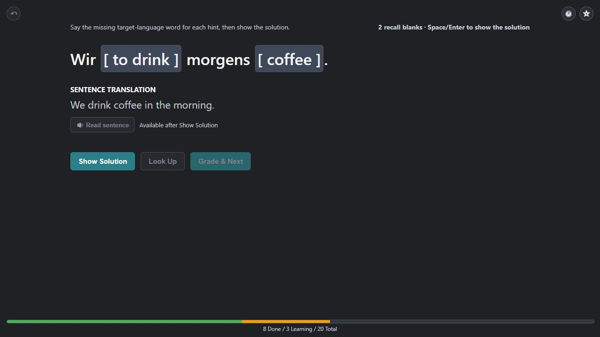
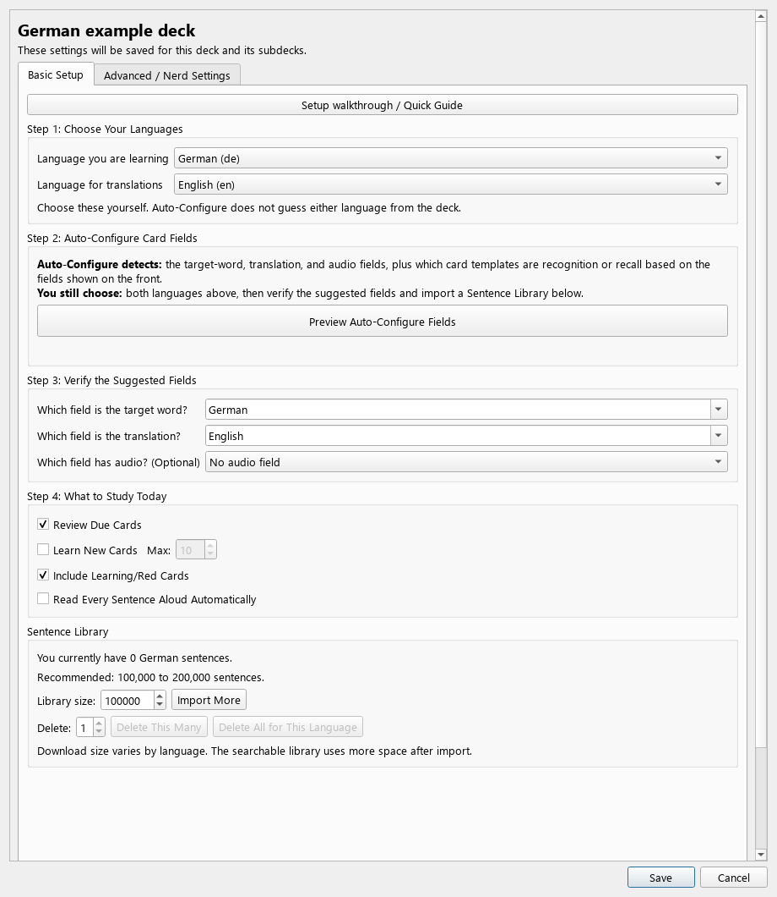
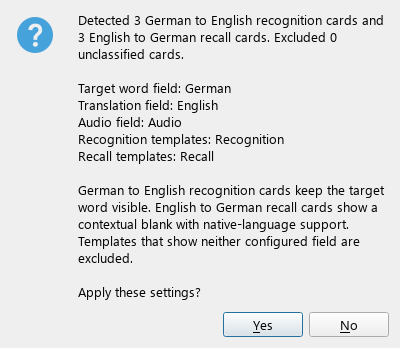
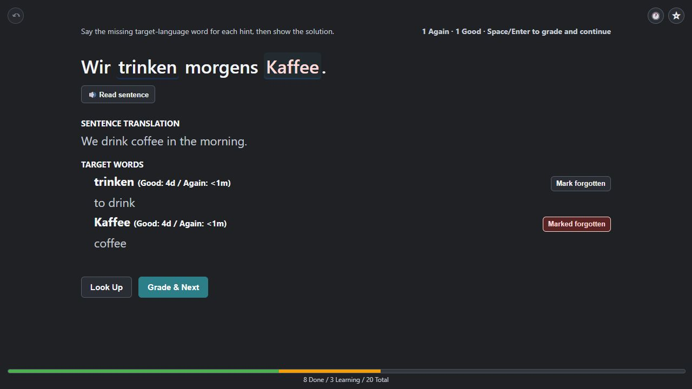

# Contextual Spaced Repetition

### Practise your Anki vocabulary in changing sentences.

[Download for Anki](https://github.com/marcelharouatmosquera-cloud/contextual-spaced-repetition/releases/latest) · [User guide](docs/USER_GUIDE.md) · [Report a bug](https://github.com/marcelharouatmosquera-cloud/contextual-spaced-repetition/issues/new?template=bug_report.yml)

This is an independent attempt to bring the **sentence-based spaced repetition**
approach studied by **Benjamin Paddags, Daniel Hershcovich, and Valkyrie Savage**
at the University of Copenhagen into Anki. Their 2024 paper,
[*Automated Sentence Generation for a Spaced Repetition Software*](https://aclanthology.org/2024.bea-1.29/),
introduced **AllAI**: practise several due words in a sentence while scheduling
each word separately.

This add-on follows the paper's sentence-retrieval approach. It finds examples
in a local library, turns your vocabulary cards into recognition or recall
exercises, and sends your answers to Anki. **Anki keeps scheduling each card
independently**, using your learning steps and scheduler, including FSRS.

*Example data rendered with the add-on's actual review interface. Produce the
missing words before revealing. The bar shows 8 done, 3 learning, and 20 total;
these are illustrative values, not study results.*

## Why practise this way?

- **Context:** see a word's meaning and inflected form in a complete sentence.
- **Several targets, separate schedules:** a suitable sentence can review more
  than one due word, with individual Again/Good answers.
- **Variety:** changing examples help you practise beyond one familiar card.
  Sentences can repeat when the library has few suitable alternatives.
- **Two directions:** understand visible words on recognition cards; produce
  missing target-language forms on recall cards.

The study reported roughly four times greater vocabulary-learning efficiency
in its sentence-based groups than its single-word baseline, which also showed
an example sentence. It involved **26 Danish learners over ten days**. These
promising short-term findings concern AllAI, **not a measured result for this
add-on or a guarantee of faster learning**. Read the
[research notes and original PDF](docs/research/README.md) for the limitations
and differences from the study.

## Install

1. Use [Anki Desktop](https://apps.ankiweb.net/), version 23.10 or later.
2. Download **contextual_review_addon.ankiaddon** from the
   [latest release](https://github.com/marcelharouatmosquera-cloud/contextual-spaced-repetition/releases/latest).
   Choose this asset, rather than GitHub's source-code ZIP.
3. Open **Tools → Add-ons → Install from file**, select the download, and restart Anki.

You need a vocabulary deck and a sentence library in its language. The bundled
library is a tiny test sample. This desktop add-on does not run in AnkiDroid or
AnkiMobile. Live checks have used Windows with Anki 25.09.4; other platforms have
not had a live acceptance test.

**Updates:** install the newer `.ankiaddon` the same way and restart. Add-on
settings and files under `user_files/` are preserved.

## Simple setup: Auto-Configure first

**Choose a deck → choose both languages → preview and apply → verify fields → import sentences → save.**

1. Select your vocabulary deck. Open **Tools → Contextual Review → Settings**
   and click the deck you want to configure.
2. In **Basic Setup**, choose **Language you are learning** and **Language for
   translations**. Auto-Configure does not choose the languages for you.
3. Click **Preview Auto-Configure Fields**. Read the preview: the target field
   should contain the word being learned, the translation field its meaning,
   and recognition/recall templates should match the two card directions.
4. Click **Yes** to apply the proposal to the editor. Verify the suggested
   fields in Step 3. Audio is optional. If the proposal is wrong, choose No and
   set the fields yourself; check the template lists in Advanced settings.

*An isolated example deck. Your field names may differ: Word/Meaning, Front/Back,
Expression/Definition, and language-named fields are all possible.*

*Check which fields and card directions were detected, then confirm. Applying
this preview changes the editor; **Save** commits the settings.*

5. Keep **Review Due Cards** and **Include Learning/Red Cards** enabled. Add new
   cards gradually once you are comfortable with the review flow.
6. In **Sentence Library**, choose a **Library size** and click **Import More**.
   The UI suggests 100,000–200,000 sentences; this is a practical starting range,
   not a scientific requirement. Time and disk usage vary by language.
7. Click **Save**. Run **Tools → Contextual Review → Diagnostics** and address
   errors, then click **Start Contextual Review** on the deck screen.

For another language deck, repeat setup for that deck. Most users can leave
Advanced settings alone. The [user guide](docs/USER_GUIDE.md) explains custom
sentence imports, word forms, and troubleshooting.

## Review in four steps

| Step | What to do |
| --- | --- |
| **Try** | Understand the visible target on recognition cards. For recall, say or think of the missing word before revealing. |
| **Reveal** | Click **Show Solution** or press **Space**. Check the answer, meaning, and available audio. |
| **Mark misses** | Click only targets you **did not remember**, or use **Mark forgotten**. Leave remembered targets unmarked. |
| **Continue** | Press **Grade & Next**. Marked targets receive **Again**; unmarked targets receive **Good**. |

*Example: Kaffee is marked forgotten and will receive Again; trinken is left
unmarked and will receive Good. The shown intervals are illustrative; your
intervals come from Anki.*

**Accidental answer?** Press **Ctrl+Z immediately** to undo the previous
contextual batch. Opening a review or revealing its solution does not grade cards.

The progress bar shows **green = finished for today**, **orange = learning or
relearning later today**, and **gray = remaining work from the initial session
goal**. “Nothing due right now” may mean a learning step is still waiting.

**Useful extras:** the star saves a favorite; the clock opens the last 100
sentences. Hover over a non-target word for a translation. **Add Note** explicitly
creates or reuses a vocabulary note; favorites can also be exported to a deck.
See [mining and undo](docs/USER_GUIDE.md#sentences-audio-and-useful-extras).

## My practical suggestion

Begin with a small, familiar deck and a short session. Make an honest attempt
before revealing; recognising an answer only after seeing it is a miss. If
sentences feel overwhelming, use simpler material or a shorter sentence range.

After reveal, say one useful sentence aloud and change a detail to make it your
own. Mine selectively: choose expressions you expect to use, so the new-card
queue remains manageable. Pair this with real listening, reading, and conversation.

Once a week, check something beyond card accuracy:

- Can you give a few casual replies using the expressions you studied?
- Do you hesitate less and recover more easily when you forget a word?
- Can you understand a short example on the first listen, before reading it?

These are practice suggestions, not a protocol validated in the AllAI study.

## Online features and help

Sentence selection uses your local library and needs no LLM API key. Library
downloads need internet. Automatic translation sends the requested text to
Google; sentence audio and mined-word audio use Microsoft's online Edge TTS.
Stored translations and cached audio remain useful offline.

Click **Report a bug** on the deck screen or in the Tools menu. The GitHub form
fills in the add-on, Anki, and OS versions; add a title and describe the problem.
A GitHub account is required. Reports are public, so remove personal information
from screenshots and text. The **Version** button shows your installed version,
copies version information, and opens downloads.

---

Building or contributing? See the [developer guide](https://github.com/marcelharouatmosquera-cloud/contextual-spaced-repetition/blob/main/developer/README.md).
